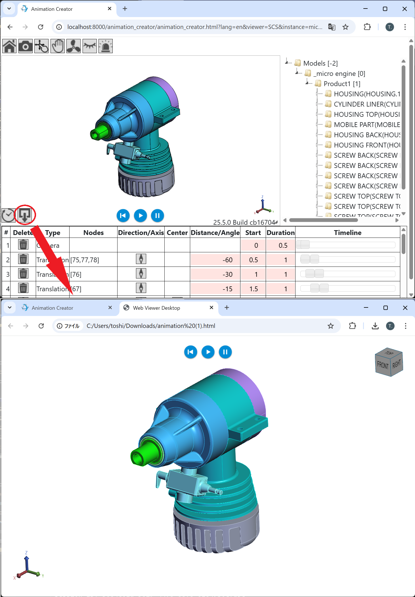

# Animation Creator Demo
## Overview
This demo showcases how to build a simple animation creation application using **HOOPS Communicator**. It is designed for use cases such as creating work instructions, simulating object assembly or disassembly, and more.

To support these use cases, we've implemented additional UI components that allow users to interact with and edit an animation timeline. Users can remove keyframes, adjust animation duration, and modify the distance and angle of node movemnts or rotatation. The animation timeline supports elements such as:
* Camera movements
* Node translations and rotations
* Visibility changes
* Part blinking (to highlight components)

In addition, the created animations can be exported as a **Monolithic HTML** file using the **Enhanced Export3DToHtml** of **HOOPS Publish**. This enables easy sharing and viewing of animated instructions without requiring a separate server or SDK.  
You can download the Enhanced Export3DToHtml build from the folowing GitHub repository:  
https://github.com/toshi-bata/Export3DToHtml_temp_build



## Dependencies
### SDKs Used (Version)
* HOOPS Communicator: 2025.5.0
* HOOPS Exchange_Publish: 2025.5.0

### Third paty module
* libmicrohttpd (1.0.1)  
  https://ftp.gnu.org/gnu/libmicrohttpd/

### Tested Server Platforms
* Windows 11
* Ubuntu Server 24.04 LTS (AWE EC2 instance)

## Setup
### Demo folders
```
animation_creator/              # Root folder
├── css/                        
├── data/                       # PRC model files
├── HtmlConverter/              # Files from Enhanced Export3DToHtml
│   ├── bin/                    # Copy all files from HOOPS_Exchange_Publish_SDK/bin/win64_v142 or linux64
│   │   └── Export3DToHtml      # Executable for Monolithic HTML conversion
│   └── template/               # Pre-divided template fragments
├── httpdServer/
│   └── bin/
│       └── HttpdServer         # HTTP daemon executable for the monolithic HTML converter
├── js/                         # Copy hoops-web-viewer.mjs and engine.esm.wasm from HOOPS_Communicator_SDK/web_viewer
│   └── animation_creator.js    # Main JavaScript
├── json/
├── model_data/
├── animation_creator.html      # Main HTML page
├── HttpServer.js
└── package.json
```

### Building `httpdServer`
#### On Windows
1. Edit `httpdServer\_VS2019.bat` to match your local environment   
2. Double-click `_VS2019.bat` to open the Visual Studio solution   
2. Build the `httpdServer` project   
3. The output `HttpdServer.exe` will be located in the `httpdServer\bin\` directory   

#### On Linux
1. Edit `httpdServer/Makefile` to suit your environment   
2. Open a terminal in the `httpdServer` directory   
3. Run `make` to build the project   
4. The resulting binary `httpdServer` will appear in `httpdServer/bin/`   

## Running the Demo
1. Open a terminal and navigate the demo root folder:  
    `cd path/to/animation_creator`  
2. Start the local server:  
    `npm install`  
    `npm start`  
3. Open a separate terminal  
4. (Linux only) Set the library path   
    `export LD_LIBRARY_PATH=/usr/local/lib:/path/to/Exchnage/bin`  
5. Start the HTTP daemon with a port (e.g., 8888):  
    `cd path/to/animation_creator/httpdServer/bin`  
    `HttpdServer 8888`  
6. Access the main HTML page with the port number (in Chrome):  
    `http://localhost:8000/animation_creator/animation_creator.html?viewer=SCS&instance=microengine&port=8888`

## Notes
* Ensure that model files (.prc) are placed in the data/ folder.
* Confirm all binaries are compatible with your platform (Windows/Linux).
* Browser console logs can help with debugging animation timeline issues.